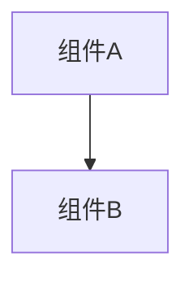

# 知识库文档模板

## A1 | 知识库文档模板

### CHANGELOG.md

```markdown
# Changelog

本文件记录项目所有重要变更。
格式基于 [Keep a Changelog](https://keepachangelog.com/zh-CN/1.0.0/),
版本号遵循 [语义化版本](https://semver.org/lang/zh-CN/)。

## [Unreleased]

## [版本号] - YYYY-MM-DD

### 新增
- [新增功能描述]

### 变更
- [变更内容描述]

### 修复
- [修复问题描述]

### 移除
- [移除内容描述]
```

---

### history/index.md

```markdown
# 变更历史索引

本文件记录所有已完成变更的索引，便于追溯和查询。

---

## 索引

| 时间戳 | 功能名称 | 类型 | 状态 | 方案包路径 |
|--------|----------|------|------|------------|
| YYYYMMDDHHMM | [功能标识] | [功能/修复/重构] | ✅已完成/[-]未执行 | [链接] |

---

## 按月归档

### YYYY-MM

- [YYYYMMDDHHMM_feature](YYYY-MM/YYYYMMDDHHMM_feature/) - [一句话功能描述]
```

---

### wiki/overview.md

```markdown
# [项目名称]

> 本文件包含项目级别的核心信息。详细的模块文档见 `modules/` 目录。

---

## 1. 项目概述

### 目标与背景
[简述项目目标和背景]

### 范围
- **范围内:** [核心功能边界]
- **范围外:** [明确不做的内容]

### 干系人
- **负责人:** [姓名/角色]

---

## 2. 模块索引

| 模块名称 | 职责 | 状态 | 文档 |
|---------|------|------|------|
| [模块名] | [核心职责] | [稳定/开发中] | [链接] |

---

## 3. 快速链接
- [技术约定](../project.md)
- [架构设计](arch.md)
- [API 手册](api.md)
- [数据模型](data.md)
- [领域语言](glossary.md)
- [变更历史](../history/index.md)
```

---

### wiki/arch.md

```markdown
# 架构设计

## 总体架构


## 技术栈
- **后端:** [语言/框架]
- **前端:** [框架/库]
- **数据:** [数据库/存储]

## 核心流程
```mermaid
sequenceDiagram
    Participant->>System: Action
```

## 重大架构决策
完整的ADR存储在各变更的how.md中，本章节提供索引。

| adr_id | title | date | status | affected_modules | details |
|--------|-------|------|--------|------------------|---------|
| ADR-[编号] | [标题] | YYYY-MM-DD | ✅已采纳/❌已废弃 | [模块列表] | [链接] |
```

---

### project.md

```markdown
# 项目技术约定

---

## 技术栈
- **核心:** [语言版本] / [框架版本]

---

## 开发约定
- **代码规范:** [引用标准或简述]
- **命名约定:** [如: 驼峰/下划线]

---

## 错误与日志
- **策略:** [统一错误处理方式]
- **日志:** [级别与格式要求]

---

## 测试与流程
- **测试:** [单元/集成测试要求]
- **提交:** [Commit Message 规范]
```

---

### wiki/api.md

```markdown
# API 手册

## 概述
[API整体说明]

## 认证方式
[认证机制说明]

---

## 接口列表

### [模块名]

#### [METHOD] [路径]
**描述:** [功能说明]

**请求参数:**
| 参数名 | 类型 | 必填 | 说明 |
|--------|------|------|------|
| [参数] | [类型] | [是/否] | [说明] |

**响应:**
```json
{
  "code": 0,
  "data": {}
}
```

**错误码:**
| 错误码 | 说明 |
|--------|------|
| [code] | [说明] |
```

---

### wiki/data.md

```markdown
# 数据模型

## 概述
[数据架构整体说明]

---

## 数据表/集合

### [表名/集合名]

**描述:** [用途说明]

| 字段名 | 类型 | 约束 | 说明 |
|--------|------|------|------|
| [字段] | [类型] | [主键/非空/唯一等] | [说明] |

**索引:**
- [索引名]: [字段列表]

**关联关系:**
- [关联说明]
```

---

### wiki/glossary.md

```markdown
# 领域语言

本文件记录项目内稳定使用的业务术语、缩写、角色、状态、流程名和禁用叫法。命名、需求描述、测试名称和文档应优先使用本表术语。

| 术语 | 定义 | 同义词/禁用叫法 | 适用模块 | 状态 | 来源 |
|------|------|----------------|----------|------|------|
| [术语] | [一句话定义] | [同义词；禁用: xxx] | [模块] | ✅已确认/❓待确认 | [需求/方案/代码路径] |

## 维护规则

- 新领域、新模块或重大功能设计前，先读取本文件。
- 用户确认的新术语优先写入本文件后再进入方案包；若当前阶段只读或无法写入，则在方案包记录为待同步项，并在开发实施的知识库同步阶段写入。
- 待确认术语不得强制用于代码命名。
- 如果代码事实与术语表冲突，先依据代码事实更新术语表，再在后续方案中处理命名统一。
```

---

### wiki/modules/<module>.md

**状态可选值:** ✅稳定 / 🚧开发中 / 📝规划中

```markdown
# [模块名称]

## 目的
[一句话说明模块用途]

## 模块概述
- **职责:** [详细职责描述]
- **状态:** [状态图标]
- **最后更新:** YYYY-MM-DD

## 规范

<!-- 🔁 针对每个需求重复以下格式 -->
### 需求: [需求名称]
**模块:** [当前模块名]
[需求描述]

#### 场景: [场景名称]
[前置条件]
- [预期结果1]
- [预期结果2]
<!-- 循环结束 -->

## API接口
<!-- 如有API则填写 -->
### [METHOD] [路径]
**描述:** [功能]
**输入:** [参数]
**输出:** [响应]

## 数据模型
<!-- 如有数据表则填写 -->
### [表名/模型名]
| 字段 | 类型 | 说明 |
|------|------|------|
| [字段] | [类型] | [说明] |

## 依赖
- [依赖模块列表]

## 变更历史
- [YYYYMMDDHHMM_feature](../../history/YYYY-MM/...) - [变更简述]
```

---
