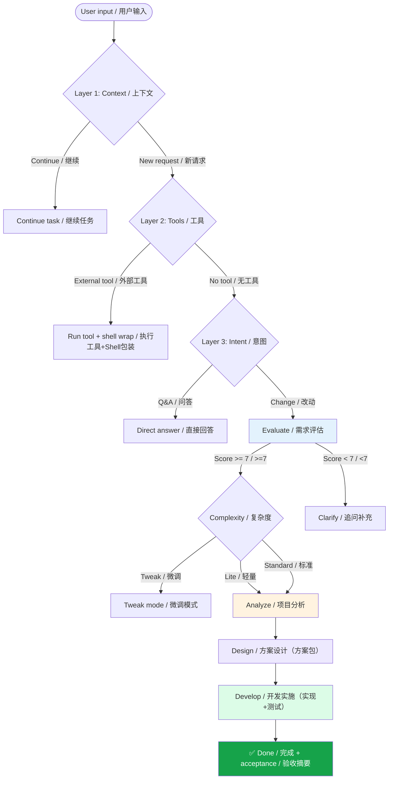

<div align="center">
  
</div>

# HelloAGENTS

<div align="center">

**An intelligent workflow system that keeps going: evaluate → implement → verify.**

[](./Codex%20CLI/AGENTS.md)
[](./Codex%20CLI/AGENTS.md)
[](./LICENSE)
[](./CONTRIBUTING.md)


</div>

<p align="center">
  <a href="./README.md"></a>
  <a href="./README_CN.md"></a>
</p>

---

## 📑 Table of Contents

<details>
<summary><strong>Click to expand</strong></summary>

- [🎯 Why HelloAGENTS?](#why)
- [📊 Data That Speaks](#data)
- [🔁 Before & After](#before-after)
- [✨ Features](#features)
- [🚀 Quick Start](#quick-start)
- [🔧 How It Works](#how-it-works)
- [📖 Documentation](#documentation)
- [❓ FAQ](#faq)
- [🛠️ Troubleshooting](#troubleshooting)
- [📈 Version History](#version-history)
- [🔒 Security](#security)
- [🙏 Acknowledgments](#acknowledgments)
- [📜 License](#license)

</details>

---

<a id="why"></a>

## 🎯 Why HelloAGENTS?

You know the pattern: the assistant gives a good analysis… then stops. Or it edits code but forgets the docs. Or it “finishes” without running anything.

**HelloAGENTS is a structured workflow system** (routing + stages + acceptance gates) that pushes the work through to a verifiable end.

| Challenge | Without HelloAGENTS | With HelloAGENTS |
|---|---|---|
| **Inconsistent outputs** | Depends on prompt quality | Unified output shell + deterministic stages |
| **Stops too early** | “Here’s what you should do…” | Keeps going: implement → test → validate |
| **No quality gates** | Manual review required | Stage / Gate / Flow acceptance |
| **Context drift** | Decisions get lost | State variables + solution packages |
| **Risky commands** | Easy to do damage | EHRB detection + workflow escalation |

### 💡 Best For

- ✅ **Coders** who want “done” to mean “verified”
- ✅ **Teams** that need consistent format and traceable changes
- ✅ **Projects** where docs are part of the deliverable

### ⚠️ Not For

- ❌ One-off snippets (a normal prompt is faster)
- ❌ Projects where you can’t keep outputs in Git
- ❌ Tasks that require hard guarantees (still review before production)

<div align="center">
  
</div>

<a id="data"></a>

## 📊 Data That Speaks

No made-up “50% faster” claims here—just things you can verify in this repo:

| Item | Value | Where to verify |
|---|---:|---|
| Routing layers | 3 | `AGENTS.md` / `CLAUDE.md` (Context → Tools → Intent) |
| Workflow stages | 4 | Evaluate → Analyze → Design → Develop |
| Execution modes | 3 | Tweak / Lite / Standard |
| Commands | 12 | `{BUNDLE_DIR}/skills/helloagents/SKILL.md` |
| Reference modules | 23 | `{BUNDLE_DIR}/skills/helloagents/references/` |
| Automation scripts | 10 | `{BUNDLE_DIR}/skills/helloagents/scripts/` |
| Bundles in this repo | 5 | `Codex CLI/`, `Claude Code/`, `Gemini CLI/`, `Grok CLI/`, `Qwen CLI/` |

<a id="before-after"></a>

## 🔁 Before & After

Sometimes the difference is easier to *feel* than to explain. Here’s a concrete “before vs after” snapshot:

| | Without HelloAGENTS | With HelloAGENTS |
|---|---|---|
| Start | You jump into implementation quickly | You start by scoring requirements and filling gaps |
| Delivery | You assemble the steps manually | The workflow keeps pushing to “verified done” |
| Docs | Often forgotten | Treated as a first-class deliverable |
| Safety | Risky ops can slip through | EHRB detection escalates risky actions |
| Repeatability | Depends on the prompt | Same stages + gates, every time |

Now let’s make it tangible. Below is a real “before/after” demo snapshot (Snake game generated with/without a structured workflow):

<table>
<tr>
<td width="50%" valign="top" align="center">

<strong>Without HelloAGENTS</strong>
<br>

<br>
<em>It works, but you’re still manually driving the process.</em>

</td>
<td width="50%" valign="top" align="center">

<strong>With HelloAGENTS</strong>
<br>

<br>
<em>More complete delivery, clearer controls, and verification steps baked in.</em>

</td>
</tr>
</table>

And here’s what the **Evaluate** stage looks like in practice: it asks the “boring but necessary” questions (platform, delivery form, controls, acceptance criteria) *before* writing code.

<div align="center">
  
  <br>
  <em>Evaluate stage: requirement scoring + targeted clarifying questions.</em>
</div>

In plain words, you’ll typically be asked to clarify:

- runtime target (browser / desktop / CLI)
- delivery form (single file / repo / packaged build)
- control scheme
- rules and difficulty preferences
- acceptance criteria (screen size, scoring, audio, obstacles, etc.)

<a id="features"></a>

## ✨ Features

Let’s be practical—here’s what you get.

<table>
<tr>
<td width="50%" valign="top">


**🧭 3-layer intelligent routing**

- Continues the same task across turns
- Detects tool calls (SKILL/MCP/plugins) vs internal workflow
- Chooses tweak / lite / standard execution based on complexity

**Benefit:** less “prompt babysitting”

</td>
<td width="50%" valign="top">


**📚 4-stage workflow engine**

- Evaluate → Analyze → Design → Develop
- Clear entry/exit gates
- Keeps artifacts as solution packages

**Benefit:** repeatable delivery, not lucky outputs

</td>
</tr>
<tr>
<td width="50%" valign="top">


**⚡ 3-layer acceptance**

- Stage-level checks
- Inter-stage gates (e.g., validate solution package)
- Flow-level acceptance summary

**Benefit:** you can trust the result more

</td>
<td width="50%" valign="top">


**🛡️ EHRB safety detection**

- Keyword scan + semantic analysis
- Escalates to confirmation when risky
- Flags destructive ops (e.g., `rm -rf`, force push)

**Benefit:** fewer “oops” moments

</td>
</tr>
</table>

<a id="quick-start"></a>

## 🚀 Quick Start

This repo ships **multiple ready-to-copy bundles** (one per AI CLI):

Codex CLI, Claude Code, Gemini CLI, Grok CLI, Qwen CLI.

### 1) Clone the repo

```bash
git clone https://github.com/hellowind777/helloagents.git
cd helloagents
```

### 2) Install (placeholder-based)

Because every CLI stores its config in a different place, the README uses placeholders.

First, pick your bundle parameters:

| Your CLI | `BUNDLE_DIR` | `CONFIG_FILE` |
|---|---|---|
| Codex CLI | `Codex CLI` | `AGENTS.md` |
| Claude Code | `Claude Code` | `CLAUDE.md` |
| Gemini CLI | `Gemini CLI` | `GEMINI.md` |
| Grok CLI | `Grok CLI` | `GROK.md` |
| Qwen CLI | `Qwen CLI` | `QWEN.md` |

Then copy **both** the config file and the `skills/helloagents/` folder into your CLI config root.

**macOS / Linux (bash)**

```bash
CLI_CONFIG_ROOT="..."
BUNDLE_DIR="Codex CLI"
CONFIG_FILE="AGENTS.md"

mkdir -p "$CLI_CONFIG_ROOT/skills"
cp -f "$BUNDLE_DIR/$CONFIG_FILE" "$CLI_CONFIG_ROOT/$CONFIG_FILE"
cp -R "$BUNDLE_DIR/skills/helloagents" "$CLI_CONFIG_ROOT/skills/helloagents"
```

**Windows (PowerShell)**

```powershell
$CLI_CONFIG_ROOT = "..."
$BUNDLE_DIR = "Codex CLI"
$CONFIG_FILE = "AGENTS.md"

New-Item -ItemType Directory -Force "$CLI_CONFIG_ROOT\\skills" | Out-Null
Copy-Item -Force "$BUNDLE_DIR\\$CONFIG_FILE" "$CLI_CONFIG_ROOT\\$CONFIG_FILE"
Copy-Item -Recurse -Force "$BUNDLE_DIR\\skills\\helloagents" "$CLI_CONFIG_ROOT\\skills\\helloagents"
```

### 3) Verify it works

In your CLI, run:

- `/helloagents` **or** `$helloagents`

Expected: a welcome message that starts with something like:

```
💡【HelloAGENTS】- 技能已激活
```

### 4) Start using it

- Try `~help` to see all commands
- Or just describe what you want; the router will pick the workflow

### 5) Optional: use multi-model bridge tools (Codex / Gemini / Claude)

The `helloagents/scripts/` folder now includes three bridge tools migrated from
`collaborating-with-codex` and `collaborating-with-gemini` (plus a Claude-compatible implementation):

- `codex_bridge.py`
- `gemini_bridge.py`
- `claude_bridge.py`

Use these when you explicitly want to delegate a sub-task to Codex CLI, Gemini CLI, or Claude CLI.

> Prerequisites: Python 3.8+, and the corresponding CLI (`codex` / `gemini` / `claude`) available in PATH.

**Codex example**

```bash
python -X utf8 "$BUNDLE_DIR/skills/helloagents/scripts/codex_bridge.py" \
  --cd "/path/to/project" \
  --PROMPT "Review auth module and return a unified diff" \
  --sandbox read-only
```

**Gemini example**

```bash
python -X utf8 "$BUNDLE_DIR/skills/helloagents/scripts/gemini_bridge.py" \
  --cd "/path/to/project" \
  --PROMPT "Review auth module and return a unified diff"
```

**Claude example**

```bash
python -X utf8 "$BUNDLE_DIR/skills/helloagents/scripts/claude_bridge.py" \
  --cd "/path/to/project" \
  --PROMPT "Review auth module and return a unified diff" \
  --sandbox read-only
```

All bridge tools return structured JSON, including:

- `success`
- `SESSION_ID` (for multi-turn continuation)
- `agent_messages`


### 6) Optional: mount standalone collaboration skills

In addition to the built-in `helloagents` package, this repo now provides optional standalone skills under:

- `skills/collaborating-with-codex/`
- `skills/collaborating-with-gemini/`
- `skills/collaborating-with-claude/`

If you want to mount one of them separately, copy the selected folder to your CLI skill root.

**Example (Codex CLI root):**

```bash
CLI_CONFIG_ROOT="~/.codex"
mkdir -p "$CLI_CONFIG_ROOT/skills"
cp -R "skills/collaborating-with-claude" "$CLI_CONFIG_ROOT/skills/collaborating-with-claude"
```

<a id="how-it-works"></a>

## 🔧 How It Works

<details>
<summary><strong>📊 Click to view the architecture diagram</strong></summary>



</details>

Key artifacts you’ll see in real projects:

- `plan/YYYYMMDDHHMM_<feature>/` solution package (proposal + tasks)
- `helloagents/` knowledge base workspace (INDEX/context/CHANGELOG/modules…)

<a id="documentation"></a>

## 📖 Documentation

This repo is intentionally a “multi-bundle distribution”.

Each bundle contains:

- Entry config: `{BUNDLE_DIR}/{CONFIG_FILE}`
- Skill package: `{BUNDLE_DIR}/skills/helloagents/`

Start here (replace `{BUNDLE_DIR}` with your chosen bundle folder):

- `{BUNDLE_DIR}/skills/helloagents/SKILL.md` (command list + entry behavior)
- `{BUNDLE_DIR}/skills/helloagents/references/` (stages, rules, services)
- `{BUNDLE_DIR}/skills/helloagents/scripts/` (automation scripts)

### What you actually copy

You copy a **config file** plus a **skill folder**:

- Config: `{CONFIG_FILE}` (picked from the table above)
- Skill: `skills/helloagents/` (includes `SKILL.md`, `references/`, `scripts/`, `assets/`)

### Configuration (the knobs you’ll actually touch)

Most people only tweak a few global settings:

```yaml
OUTPUT_LANGUAGE: zh-CN
ENCODING: UTF-8
KB_CREATE_MODE: 2
BILINGUAL_COMMIT: 1
```

**KB_CREATE_MODE** controls knowledge base writes:

- `0 (OFF)`: skip all KB operations
- `1 (ON_DEMAND)`: create KB only when explicitly requested
- `2 (ON_DEMAND_AUTO_FOR_CODING)`: auto-create for coding tasks (default)
- `3 (ALWAYS)`: always create/update KB

<a id="faq"></a>

## ❓ FAQ

<details>
<summary><strong>Q: Which bundle should I install?</strong></summary>

**A:** Match the CLI you’re using:
- Codex CLI → `Codex CLI/`
- Claude Code → `Claude Code/`
- Gemini CLI → `Gemini CLI/`
- Grok CLI → `Grok CLI/`
- Qwen CLI → `Qwen CLI/`
</details>

<details>
<summary><strong>Q: Can I install both?</strong></summary>

**A:** Yes. They live in different config roots (`~/.codex/` vs `~/.claude/`). Just don’t mix the files inside one root.
</details>

<details>
<summary><strong>Q: How do I invoke HelloAGENTS?</strong></summary>

**A:** Use `/helloagents` or `$helloagents` to explicitly activate the skill. After that, use `~help` or describe your task.
</details>

<details>
<summary><strong>Q: Where does the knowledge base go?</strong></summary>

**A:** In the *project you are working on*, HelloAGENTS writes to `helloagents/` (unless disabled). It is the single source of truth for project knowledge in the workflow.
</details>

<details>
<summary><strong>Q: How do I disable knowledge base writes?</strong></summary>

**A:** Set `KB_CREATE_MODE: 0` in your installed `AGENTS.md` / `CLAUDE.md`.
</details>

<details>
<summary><strong>Q: What if I only want a light change?</strong></summary>

**A:** The router can choose tweak mode for small, clear changes. You can also ask for “tweak mode / minimal change” explicitly.
</details>

<details>
<summary><strong>Q: What are the key commands?</strong></summary>

**A:** Try `~help`. Common ones: `~plan`, `~exec`, `~test`, `~commit`, `~validate`.
</details>

<a id="troubleshooting"></a>

## 🛠️ Troubleshooting

### Stuck in Evaluate (requirement score &lt; 7)

**Fix:** answer the clarifying questions with concrete details (inputs/outputs, files to change, acceptance criteria).

---

### Solution package validation failed

**Fix:** ensure the package has both files:

- `proposal.md`
- `tasks.md`

Then run `~validate` (or follow the tool output).

---

### “Skill not found” after copying

**Fix:**

- Confirm `skills/helloagents/SKILL.md` exists under your CLI config root (after copying)
- Re-run `/helloagents` or `$helloagents`

---

### Windows path/encoding issues

**Fix:** keep files in UTF-8, and prefer quoted paths when copying folders with spaces (like `Codex CLI/`).

<a id="version-history"></a>

## 📈 Version History

### Latest: v2.0 (2026-01)

- Positioning: from “AI programming partner” → **intelligent workflow system**
- Workflow: 3 stages → 4 stages (added **Evaluate**)
- Routing: simple routing → **3-layer routing** (Context → Tools → Intent)
- Acceptance: basic checks → **Stage / Gate / Flow** acceptance
- Bundle distribution: **Codex CLI** and **Claude Code** both supported

🆚 v1 vs v2 snapshot:

| Area | v1 (2025-12) | v2 (2026-01) |
|---|---|---|
| Positioning | AI programming partner | Intelligent workflow system |
| Stages | 3 stages | 4 stages (+ Evaluate) |
| Routing | Simple | 3 layers (Context → Tools → Intent) |
| Acceptance | Basic | 3 layers (Stage / Gate / Flow) |
| Files | 6 files | 44 files |
| Commands | 4 commands | 12 commands |

<a id="security"></a>

## 🔒 Security

- EHRB detection is designed to catch destructive or high-risk operations before they run.
- Even so, **review commands and diffs** before applying changes to important systems.

If you believe you found a security issue, prefer using GitHub’s private reporting (Security Advisories) if enabled for this repo. Otherwise, contact the maintainer via their GitHub profile.

<a id="acknowledgments"></a>

## 🙏 Acknowledgments

- AI CLI ecosystems (Codex CLI, Claude Code, etc.)
- Keep a Changelog conventions (used by the workflow knowledge base)
- MCP and the broader tool integration community

<a id="license"></a>

## 📜 License

This project uses a **dual license**:

- **Code:** Apache-2.0
- **Documentation:** CC BY 4.0

See `LICENSE` for details.
