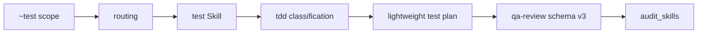

# 技术设计: TDD 混合执行与证据门禁

## 技术方案

### 核心技术

- Markdown Skill 与方案模板维护。
- Python 标准库 JSON 审计。
- Python `unittest` 回归测试。

### 实现要点

1. 新增 `skills/helloagents/test/SKILL.md`，作为 `~test [scope]` 的测试补齐入口；默认只覆盖测试与证据，不把缺失行为自动扩展为生产修复。
2. 在 routing、bootstrap、索引和审计命令集合中注册 `~test`。
3. 将新生成的 `qa-review.json` 固定为 schema v3，并加入 `tdd` 对象。
4. `audit_skills.qa_json_errors` 继续兼容 v1/v2；针对 v3 校验完整 TDD 阶段或豁免信息。
5. 用单元测试覆盖有效 TDD、缺失 TDD、错误 RED 结果和有效豁免。

## 设计边界

- **范围内:** 测试命令的规则入口、QA 证据 schema、静态审计和文档化流程。
- **范围外:** 为每个宿主开发真正的命令解析器；此仓库的 Skill 规则仍由宿主读取执行。
- **模块职责:** `test` 负责目标范围和测试行为；`tdd` 负责质量规则；`qa-review` 负责证据文件；`audit_skills` 负责离线验证；`routing` 负责命令发现与授权说明。
- **接口契约:** 新 QA 记录使用 schema v3；schema v1/v2 继续读取；v3 必须含 `tdd`。
- **数据边界:** 仅读写方案包中的 `qa-review.json`，不访问外部服务。
- **依赖边界:** 不新增运行时依赖。
- **大型项目最小改动:** 只修改与 TDD 路径、QA schema 和审计契约直接相关的文件；不重构其他工作流。

## 架构设计



## 架构决策 ADR

### ADR-007: 在 QA 证据中承载 TDD 阶段记录
**上下文:** TDD 证据目前分散在任务备注或最终摘要，离线审计无法稳定读取。
**决策:** 将新记录升级到 `qa-review.json` schema v3，并以 `tdd` 对象记录分类、决策和阶段结果。
**理由:** QA 文件随方案包归档，已有 JSON 审计入口，避免新增第二份证据文件。
**替代方案:** 新建 `tdd-evidence.json` → 拒绝原因: 增加文件和迁移复杂度，且与 QA 交付证据重复。
**影响:** 新 v3 文件必须携带 TDD 信息；旧 v1/v2 文件保持兼容。
**状态:** 已采纳

## QA schema v3

```json
{
  "schema_version": 3,
  "tdd": {
    "classification": "mandatory|recommended|exempt|uncertain",
    "decision": "tdd|exempt",
    "target_behaviors": ["可观察行为"],
    "red": {"command": "...", "result": "failed", "summary": "..."},
    "green": {"command": "...", "result": "passed", "summary": "..."},
    "refactor": {"performed": false, "command": "...", "result": "passed", "summary": "..."},
    "verify": {"command": "...", "result": "passed", "summary": "..."}
  }
}
```

- `decision=tdd` 需要全部阶段对象，且 `classification=mandatory` 不得豁免。
- `decision=exempt` 需要 `exempt_reason`、`alternative_verification` 和至少一个目标行为。
- 已实现行为的补测可标记豁免，但必须说明生产实现早于本次测试及替代验证。

## 安全与性能

- **安全:** 不引入外部调用、密钥或危险命令；测试命令不自动修改生产行为。
- **性能:** 审计只读取少量 JSON 文件和 Markdown，不增加网络或重型依赖。

## 测试与部署

- **测试:** 先为 `qa_json_errors` 的 v3 契约添加失败单元测试，再实现验证器；运行全量 `unittest` 与审计脚本。
- **部署:** 修改两端镜像后由既有安装/漂移检查机制分发，无需单独部署。
