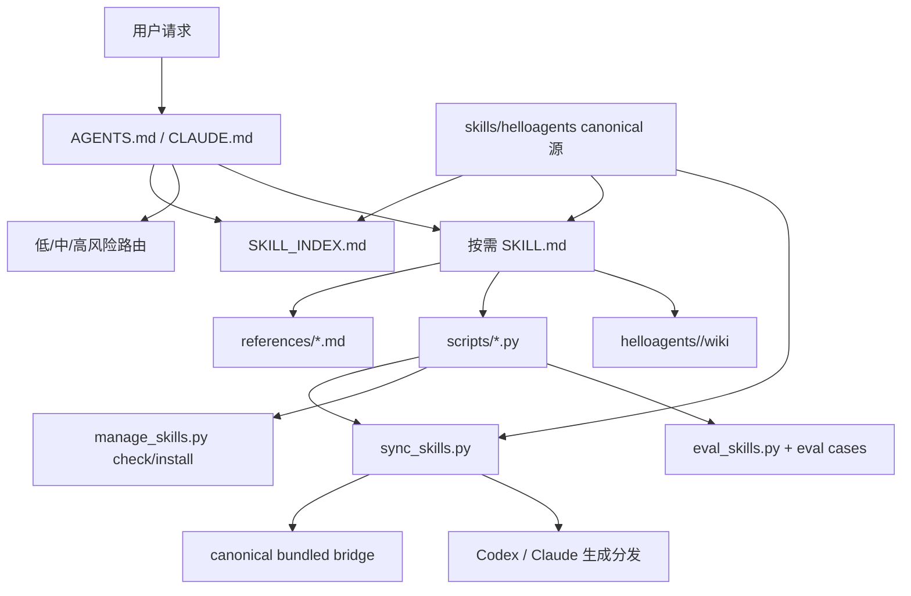

# 架构设计

## 总体架构

## 核心原则

- Bootstrap 保持在 120 行以内，只保存稳定原则、安全边界、自适应路由、命令和 skill 索引。
- `SKILL.md` 保持可快速加载，长内容通过 progressive disclosure 下沉。
- `skills/helloagents/` 是唯一手工维护源；Codex 与 Claude 目录由同步脚本生成并通过只读审计验证。
- 特殊命令授权使用 `WORKFLOW_ID` 绑定；普通低/中风险改动使用用户自然语言中的明确写入授权。
- 路由以可逆性、外部副作用、公共契约、数据迁移、EHRB 和不确定性为主，文件数仅作为辅助信号。
- 行为 eval 固化代表性提示的预期路由、动作、确认、产物和风险等级，并支持导入实际结果评分。
- QA 使用 schema v3 的 `gate_status` 与结构化 `tdd` 证据作为归档门禁，归档引用统一绑定 `RESOLVED_ARCHIVE_PATH`。
- 外部模型审查先通过数据出境门禁，再使用 CLI 原生 plan 权限模式和终止整个进程树的有界超时。
- 风险路由不引入 Light/Heavy 持久模式；输出模板只服务正式命令、复杂交付和交互，知识库写入通过复用价值门禁。

## 重大架构决策

| adr_id | title | date | status | affected_modules | details |
|--------|-------|------|--------|------------------|---------|
| ADR-001 | 不引入 `_shared/` 共享机制，维持多端入口 | 2026-05 | 已取代 | Bootstrap | [history/2026-05/202605142129_slim_bootstrap/how.md](../history/2026-05/202605142129_slim_bootstrap/how.md) |
| ADR-002 | 抽取 `routing` Skill 但 bootstrap 保留最小路由决策树 | 2026-05 | 已记录 | Bootstrap, routing | [history/2026-05/202605142129_slim_bootstrap/how.md](../history/2026-05/202605142129_slim_bootstrap/how.md) |
| ADR-003 | 大型 `SKILL.md` 拆为轻量入口 + `references/` | 2026-07 | 已采纳 | Skills | [history/2026-07/202607022207_skill_system_refactor/how.md](../history/2026-07/202607022207_skill_system_refactor/how.md) |
| ADR-004 | 吸收 grill-with-docs 机制而非新增独立流程 | 2026-07 | 已采纳 | analyze, design, kb | [history/2026-07/202607022207_skill_system_refactor/how.md](../history/2026-07/202607022207_skill_system_refactor/how.md) |
| ADR-005 | 使用显式状态机替代隐式布尔授权 | 2026-07 | 已采纳 | routing, lifecycle, develop | [history/2026-07/202607111100_skill_runtime_hardening/how.md](../history/2026-07/202607111100_skill_runtime_hardening/how.md) |
| ADR-006 | bridge 作为 Skill 自包含资源分发 | 2026-07 | 已采纳 | collaborating-*, scripts | [history/2026-07/202607111100_skill_runtime_hardening/how.md](../history/2026-07/202607111100_skill_runtime_hardening/how.md) |
| ADR-007 | 在 QA 证据中承载 TDD 阶段记录 | 2026-07 | 已采纳 | tdd, test, qa-review, audit_skills | [history/2026-07/202607121222_tdd_hybrid_enforcement/how.md](../history/2026-07/202607121222_tdd_hybrid_enforcement/how.md) |
| ADR-008 | 默认采用风险自适应路由并保留严格命令路径 | 2026-07 | 已采纳 | Bootstrap, routing, develop, eval | [history/2026-07/202607152110_adaptive_skill_routing/how.md](../history/2026-07/202607152110_adaptive_skill_routing/how.md) |
| ADR-009 | canonical Skill 单一源生成宿主分发 | 2026-08 | 已采纳 | Skills, scripts, CI | [modules/skills.md](modules/skills.md#canonical-源与生成分发) |
