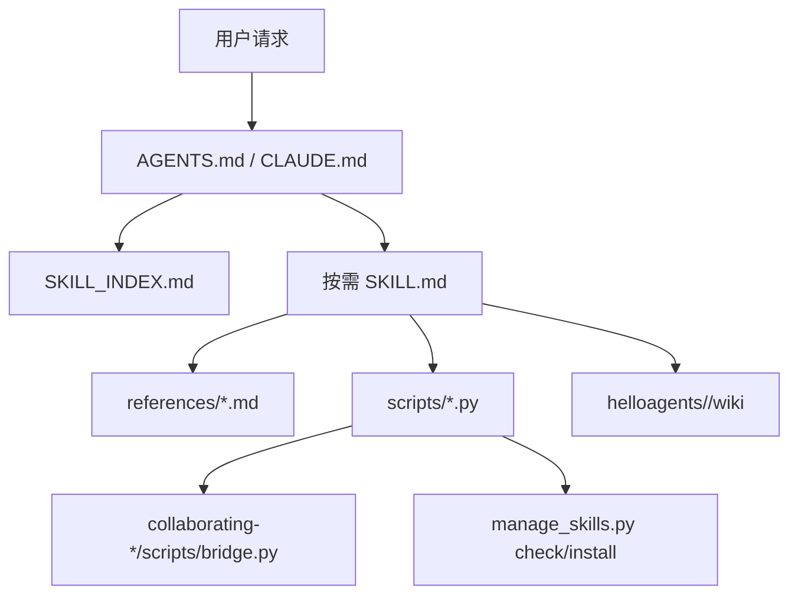

# 架构设计

## 总体架构

## 核心原则

- Bootstrap 保持轻量，只保存全局规则、最小路由和 skill 引用表。
- `SKILL.md` 保持可快速加载，长内容通过 progressive disclosure 下沉。
- Codex 与 Claude 目录保持一致，通过只读审计脚本验证。
- 工作流授权使用 `WORKFLOW_ID` 绑定，等待态使用单一 `PENDING_INTERACTION`，终态统一清理。
- QA 使用 schema v3 的 `gate_status` 与结构化 `tdd` 证据作为归档门禁，归档引用统一绑定 `RESOLVED_ARCHIVE_PATH`。
- 外部模型审查先通过数据出境门禁，再使用 CLI 原生 plan 权限模式和终止整个进程树的有界超时。

## 重大架构决策

| adr_id | title | date | status | affected_modules | details |
|--------|-------|------|--------|------------------|---------|
| ADR-001 | 不引入 `_shared/` 共享机制，维持多端入口 | 2026-05 | 已记录 | Bootstrap | [history/2026-05/202605142129_slim_bootstrap/how.md](../history/2026-05/202605142129_slim_bootstrap/how.md) |
| ADR-002 | 抽取 `routing` Skill 但 bootstrap 保留最小路由决策树 | 2026-05 | 已记录 | Bootstrap, routing | [history/2026-05/202605142129_slim_bootstrap/how.md](../history/2026-05/202605142129_slim_bootstrap/how.md) |
| ADR-003 | 大型 `SKILL.md` 拆为轻量入口 + `references/` | 2026-07 | 已采纳 | Skills | [history/2026-07/202607022207_skill_system_refactor/how.md](../history/2026-07/202607022207_skill_system_refactor/how.md) |
| ADR-004 | 吸收 grill-with-docs 机制而非新增独立流程 | 2026-07 | 已采纳 | analyze, design, kb | [history/2026-07/202607022207_skill_system_refactor/how.md](../history/2026-07/202607022207_skill_system_refactor/how.md) |
| ADR-005 | 使用显式状态机替代隐式布尔授权 | 2026-07 | 已采纳 | routing, lifecycle, develop | [history/2026-07/202607111100_skill_runtime_hardening/how.md](../history/2026-07/202607111100_skill_runtime_hardening/how.md) |
| ADR-006 | bridge 作为 Skill 自包含资源分发 | 2026-07 | 已采纳 | collaborating-*, scripts | [history/2026-07/202607111100_skill_runtime_hardening/how.md](../history/2026-07/202607111100_skill_runtime_hardening/how.md) |
| ADR-007 | 在 QA 证据中承载 TDD 阶段记录 | 2026-07 | 已采纳 | tdd, test, qa-review, audit_skills | [history/2026-07/202607121222_tdd_hybrid_enforcement/how.md](../history/2026-07/202607121222_tdd_hybrid_enforcement/how.md) |
